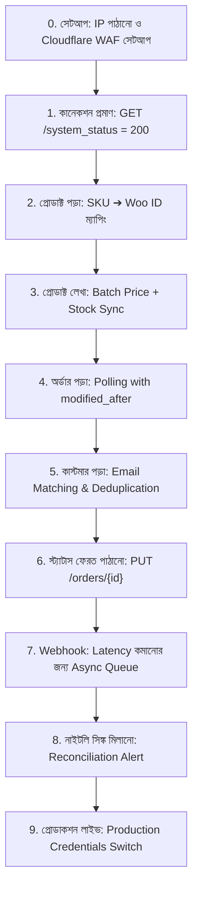

# ERPNext ⇄ WooCommerce Integration Brief: 
## পূর্ণাঙ্গ গাইডলাইন, ব্যাখ্যা ও সমাধান নির্দেশিকা (Detailed Guide & Solution Blueprint)

এই ডকুমেন্টটিতে **Dressup WooCommerce Store** এবং **ERPNext** এর মধ্যকার ইন্টিগ্রেশন ব্রিফের একটি পূর্ণাঙ্গ টেকনিক্যাল ব্যাখ্যা এবং **সমস্যার সমাধান গাইডলাইন (Solution Blueprint)** প্রদান করা হয়েছে। প্রজেক্টটির মূল উদ্দেশ্য, শর্তাবলি, ডাটা ফ্লো, টেকনিক্যাল ম্যাপিং, চেকলিস্ট, প্লাগিন ব্যবহারের ব্যাখ্যা এবং প্রতিটি সম্ভাব্য সমস্যার সঠিক সমাধান নিচে তুলে ধরা হলো।

---

## ১. সারসংক্ষেপ ও স্থাপত্য নীতি (Architecture Overview)

* **মূল উদ্দেশ্য:** ERPNext এবং WooCommerce স্টোরের মধ্যে **Product**, **Order** এবং **Customer** ডাটা নিরবচ্ছিন্নভাবে সিঙ্ক (Sync) রাখা।
* **আর্কিটেকচারাল দৃষ্টিভঙ্গি:** এটি একটি **Standard REST API (v3)** নির্ভর ইন্টিগ্রেশন। 
* **WooCommerce সার্ভারের জন্য নিয়ম:** WooCommerce সার্ভারে কোনো কাস্টম WordPress প্লাগিন, PHP স্নিপেট, থিম এডিট বা কাস্টম হুক লেখা সম্পূর্ণ নিষেধ।
* **ERPNext সার্ভারের জন্য নিয়ম:** সমস্ত বিজনেস লজিক, সিডিউলিং (Scheduling), ডাটা ম্যাপিং, রিট্রাই (Retry) পলিসি এবং স্ট্যাটাস ট্র্যাকিং থাকবে ERPNext (আপনার কাস্টম অ্যাপ `woo_prime`) এর ভেতর।

---

## ২. প্রাথমিক ধাপ: সার্ভার IP ও Cloudflare সেটআপ

WooCommerce স্টোরটি Cloudflare Web Application Firewall (WAF) দ্বারা সুরক্ষিত। ERPNext সার্ভার থেকে আসা অনুরোধগুলো যেন Cloudflare এ ব্লক না হয়, সে জন্য IP Allow-list করা প্রয়োজন।

### প্রাথমিক করণীয়:
১. ERPNext সার্ভারের আউটবাউন্ড (Outbound) পাবলিক IP এড্রেস বের করতে সার্ভারে নিচের কমান্ডটি চালান:
   ```bash
   curl -s https://www.cloudflare.com/cdn-cgi/trace | grep '^ip='
   ```
২. যদি একাধিক ওয়র্কার (Worker) বা লোড ব্যালেন্সার থাকে, তবে সবগুলোর IP অথবা **CIDR Range** প্রদান করুন।
৩. এই IP এড্রেসটি ড্রেসআপ টিমকে প্রদান করলে তারা Cloudflare এ Custom Allow-list Rule সেটআপ করবে।

> **সতর্কতা:** সরাসরি Origin IP দিয়ে কানেক্ট করার চেষ্টা করা নিষেধ। স্বাভাবিক Hostname (যেমন: `erpsync.dressup.com.bd`) ব্যবহার করতে হবে।

---

## ৩. ইন্টিগ্রেশনের ৪টি মৌলিক শর্ত (Core Conditions) ও বিস্তারিত ব্যাখ্যা

ইন্টিগ্রেশন প্রজেক্টটি যে ৪টি মৌলিক শর্তের ওপর প্রতিষ্ঠিত, সেগুলোর টেকনিক্যাল কারণ, গুরুত্ব এবং সঠিক বাস্তবায়ন পদ্ধতি নিচে বিশদভাবে ব্যাখ্যা করা হলো:

### ১. কোনো কাস্টম প্লাগিন নয় (No Custom Plugin Rule)
* **শর্তের সারসংক্ষেপ:** WooCommerce সার্ভারে কোনো প্রকার কাস্টম WordPress প্লাগিন, PHP স্নিপেট, কাস্টম এনডপয়েন্ট বা থিম কোড যোগ করা যাবে না। শুধুমাত্র WooCommerce এর ইন-বিল্ট **Standard REST API (v3)** ব্যবহার করতে হবে।
* **কেন এই শর্ত রাখা হয়েছে (Rationale):**
  * **স্থিতিশীলতা ও আপগ্রেড সুবিধা:** WordPress ও WooCommerce প্রতিনিয়ত আপডেট হয় (যেমন বর্তমান WooCommerce 11.1.0+)। কাস্টম PHP প্লাগিন লিখলে স্টোর আপডেটের সময় কোড ক্র্যাশ করে।
  * **সিকিউরিটি ঝুঁকি হ্রাস:** কাস্টম প্লাগিন বা হুক্স তৈরি করলে ওয়েবসাইটে থার্ড-পার্টি সিকিউরিটি হোল (Vulnerability) তৈরি হওয়ার আশঙ্কা থাকে।
* **সঠিক বাস্তবায়ন পদ্ধতি (Implementation):**
  * WooCommerce Admin থেকে `WooCommerce → Settings → Advanced → REST API` তে গিয়ে Read/Write পারমিশনসহ Consumer Key ও Consumer Secret জেনারেট করবেন।
  * ERPNext-এর ভেতরে Python `requests` লাইব্রেরি ব্যবহার করে সরাসরি এপিআই এনডপয়েন্ট (যেমন `/wp-json/wc/v3/products`, `/wp-json/wc/v3/orders`) কল করবেন।

---

### ২. Cloudflare প্রটেকশন বহাল রাখা (Cloudflare Protection Intact Rule)
* **শর্তের সারসংক্ষেপ:** WooCommerce স্টোরের সামনে থাকা Cloudflare প্রটেকশন সার্বিকভাবে বন্ধ করা যাবে না। সিকিউরিটি বজায় রেখেই ইন্টিগ্রেশন চালু রাখতে হবে।
* **কেন এই শর্ত রাখা হয়েছে (Rationale):**
  * **ওয়েবসাইট সুরক্ষা:** Cloudflare ওয়েবসাইটকে DDoS আক্রমণ, ক্রেনশিয়াল স্টাফিং বট, ক্ষতিকর স্ক্যানার এবং ডাটা স্ক্র্যাপিং থেকে রক্ষা করে। এটি বন্ধ করলে স্টোর ঝুঁকিতে পড়ে।
  * **টগল গ্লোবাল না করা:** Cloudflare এ সিকিউরিটি অফ করলে তা পুরো সাইটের জন্য বন্ধ হয়ে যায়, যা অত্যন্ত বিপজ্জনক।
* **সঠিক বাস্তবায়ন পদ্ধতি (Implementation):**
  * ERPNext সার্ভারের আউটবাউন্ড IP বের করে ড্রেসআপ টিমকে দিতে হবে।
  * ড্রেসআপ টিম Cloudflare WAF এ একটি **Custom Allow-list Rule** বসাবে, যা কেবল আপনার ERPNext IP এবং নির্দিষ্ট API Path (`/wp-json/wc/v3/*`) এর জন্য সিকিউরিটি নিয়ম শিথিল করবে।
  * কানেকশন সবসময় ডোমেইন Hostname (`erpsync.dressup.com.bd`) দিয়ে করতে হবে, কখনোই সরাসরি Origin IP দিয়ে নয়।

---

### ৩. ভারী সব কাজ ERPNext-এ করা (Heavy Work on ERPNext Rule)
* **শর্তের সারসংক্ষেপ:** Data Pulling, Data Pushing, Scheduling, Mapping, Monitoring, Network Error Handling এবং Retry Management — সকল ভারী প্রসেসিং ERPNext-এর ভেতরে সম্পন্ন হতে হবে।
* **কেন এই শর্ত রাখা হয়েছে (Rationale):**
  * **WooCommerce এর পারফরম্যান্স রক্ষা:** WooCommerce হলো একটি সেলস ফ্রন্টএন্ড। সিঙ্ক ইঞ্জিন বা ভারী হিসাব-নিকাশ WooCommerce-এ চালালে ডেটাবেজ লক হয় এবং ওয়েবসাইট স্লো হয়ে যায়।
  * **একক স্টেট ট্র্যাকিং:** সিঙ্কের অবস্থা (State) সবসময় ইন্টিগ্রেট করা সিস্টেমে (ERPNext) থাকা উচিত।
* **সঠিক বাস্তবায়ন পদ্ধতি (Implementation):**
  * **পলিং (Polling):** ERPNext-এর Scheduled Job (Celery Worker) দিয়ে নির্দিষ্ট সময় পর পর (`modified_after` GMT ISO timestamp ব্যবহার করে) WooCommerce থেকে নতুন বা পরিবর্তিত অর্ডার টেনে আনা।
  * **ব্যাচ পুশ (Batch Push):** ERPNext থেকে প্রোডাক্ট আপডেট করার সময় `POST /products/batch` দিয়ে সর্বোচ্চ ১০০টি প্রোডাক্ট একসাথে পাঠানো।
  * **ম্যাপিং টেবিল:** `woocommerce_product_id`, `woocommerce_order_id`, `woocommerce_customer_id` ফিল্ডগুলো ERPNext-এর Item, Sales Order ও Customer ডকুমেন্টে সেভ রাখা।
  * **নেটওয়ার্ক রিট্রাই:** HTTP 429/5xx এর ক্ষেত্রে Exponential Back-off নীতি ERPNext Python ব্যাকগ্রাউন্ড জবে ইমপ্লিমেন্ট করা।

---

### ৪. চেকআউট সম্পূর্ণ মুক্ত রাখা (Zero Checkout Overhead Rule)
* **শর্তের সারসংক্ষেপ:** কাস্টমার যখন ওয়েবসাইটে কার্ট বা চেকআউট পেজে কেনাকাটা করবে, তখন ERPNext-এর কোনো API কল, লাইভ প্রাইসিং হিসাব বা সিনক্রোনাস লজিক সেখানে চলবে না। চেকআউট থাকবে ১০০% স্বাধীন।
* **কেন এই শর্ত রাখা হয়েছে (Rationale):**
  * **বিক্রি নিশ্চিত করা:** চেকআউটের সময় ERPNext এ সিনক্রোনাস কল করা হলে (যা পুরানো প্লাগিনে করা হতো), ERPNext সার্ভার সামান্য ধীরগতির বা বন্ধ থাকলে চেকআউট পেজ ১২ সেকেন্ড পর্যন্ত আটকে থাকত এবং কেনাকাটা ফেল করত।
  * **ডাউনটাইম সেফটি:** ERPNext সার্ভার মেইনটেন্যান্সের জন্য ১ ঘণ্টা বন্ধ থাকলেও যেন ওয়েবসাইট থেকে নির্বিঘ্নে বিক্রি চলতে পারে।
* **সঠিক বাস্তবায়ন পদ্ধতি (Implementation):**
  * WooCommerce তার নিজস্ব ডাটাবেজে থাকা মূল্যে কাস্টমারকে চেকআউট সম্পন্ন করতে দেবে।
  * চেকআউট সম্পন্ন হওয়ার পর অর্ডারের তথ্য সম্পূর্ণ আসিনক্রোনাসলি (Asynchronously) ব্যাকগ্রাউন্ড পলিং বা ওয়েব হুকের মাধ্যমে ERPNext-এ আসবে।
  * ERPNext সাময়িক বন্ধ থাকলে পরবর্তীতে চালু হওয়ার পর পেন্ডিং সব ব্যাকলগ অর্ডার টেনে নিয়ে আপডেট সম্পন্ন করবে।

---


## ৪. রেডিনেস চেক (10 Readiness Tests)

Staging Credential পাওয়ার আগে আপনার লোকাল বা নিজস্ব টেস্ট WooCommerce স্টোরে নিচের ১০টি টেস্ট সফলভাবে চালাতে হবে এবং টার্মিনালের প্রকৃত আউটপুট ড্রেসআপ টিমকে জমা দিতে হবে:

| # | টেস্টের নাম | বিবরণ ও প্রত্যাশিত আউটপুট |
|---|---|---|
| **১** | **কানেকশন টেস্ট** | `GET /wp-json/wc/v3/system_status` এ কল করে **HTTP 200** নিশ্চিত করা। |
| **২** | **ব্যাচ প্রোডাক্ট তৈরি** | `POST /products/batch` দিয়ে ১০০টি প্রোডাক্ট তৈরি করা এবং Response-এর প্রতিটি আইটেমে `error` key ফিল্টার করা। |
| **৩** | **আইডেমপোটেন্সি (Idempotency)** | পুরো প্রোডাক্ট সিঙ্ক দ্বিতীয়বার চালানো; দ্বিতীয়বারে কোনো নতুন প্রোডাক্ট বা ডাটা পরিবর্তন হবে না। |
| **৪** | **আংশিক প্রোডাক্ট আপডেট** | শুধুমাত্র দাম এবং স্টক সংখ্যা আপডেট করা। `status`, `name`, `description` ফিল্ডগুলো যেন অপরিবর্তিত থাকে। |
| **৫** | **অর্ডার পলিং (Order Polling)** | ৩টি টেস্ট অর্ডার ওয়েবসাইট থেকে তৈরি করে ERPNext Poller দিয়ে ৩টি সঠিক **Sales Order** তৈরি করা। |
| **৬** | **পলার পুনরাবৃত্তি (Re-polling)** | Poller পুনরায় সাথে সাথে চালালেও অর্ডার সংখ্যা ৩টিই থাকবে (ডুপ্লিকেট Sales Order তৈরি হবে না)। |
| **৭** | **ওয়েবহুক রিপ্লে (Webhook Replay)** | একটি ওয়েবহুক রেজিস্টার করে ৫ বার Replay করলেও ERPNext এ ঠিক **১টিই Sales Order** থাকবে। |
| **৮** | **ভুল সিগনেচার টেস্ট** | ইচ্ছাকৃত ভুল Webhook Signature পাঠালে ERPNext যেন **HTTP 401 Unauthorized** রেসপন্স ফেরত দেয়। |
| **৯** | **HTTP 500 Error Handling** | সার্ভার থেকে 500/502/503 দিলে Exponential Back-off (1s, 2s, 4s, 8s, 16s) মেনে পরবর্তীতে চেষ্টা করা। |
| **১০**| **HTTP 404 Error Handling** | সার্ভার 404 দিলে সাথে সাথে থামা এবং রিট্রাই (Retry) না করা। |

---

## ৫. স্কোপ নির্দেশিকা (In-Scope vs Out-of-Scope)

### ✅ ইন-স্কোপ (যা যা তৈরি করতে হবে):
* **Product Sync:** ERPNext Item (`item_code`, দাম, স্টক) → WooCommerce Product।
* **Order Sync:** WooCommerce Order (বিক্রি, লাইন আইটেম, টোটাল, ঠিকানা) → ERPNext Sales Order।
* **Customer Sync:** WooCommerce Customer (নাম, ইমেইল, ঠিকানা) → ERPNext Customer।
* **Order Status:** ERPNext Order Status (Fulfilled, Cancelled, Refunded) → WooCommerce Order Status।

### ❌ স্কোপের বাইরে (যা যা তৈরি করা যাবে না):
* লাইভ ERPNext Pricing Rule ওয়েবসাইটের কার্টে (Cart) চালানো।
* চেকআউটে ডায়নামিক Loyalty Point Redemption লজিক যুক্ত করা।
* কাস্টম ড্যাশবোর্ড উইজেট তৈরি করা।
* প্রথমাংশে (Phase 1) প্রোডাক্টের ছবি, ক্যাটাগরি এবং ভ্যারিয়েশন (Variation) সিঙ্ক করা।

---

## ৬. সিস্টেম ডোমেইন ম্যাপিং ও ডাটা আইডেন্টিটি

দুইটি ভিন্ন সিস্টেমে ডাটা চিহ্নের প্রধান নিয়মাবলী:

```
[ ERPNext ]                                   [ WooCommerce ]
Item Code (ABC-1001)   <== SKU Agreement ==>   Product SKU (ABC-1001)
woocommerce_product_id <== Pointer (ID: 872) == Product ID (872)
```

1. **প্রোডাক্ট ম্যাপিং:**
   * **চুক্তি (Contract):** ERPNext-এর `item_code` এবং WooCommerce-এর `sku` হুবহু একই স্ট্রিং হবে।
   * **পয়েন্টার (Pointer):** প্রথমবার SKU দিয়ে মিলানোর পর প্রাপ্ত WooCommerce `id` টি ERPNext Item ডকুমেন্টের `woocommerce_product_id` ফিল্ডে সেভ করে রাখতে হবে। পরবর্তীতে প্রতিটা আপডেটে সরাসরি `PUT /products/{id}` কল হবে।
   * **SKU নীতি:** SKU একবার নির্ধারণ হয়ে গেলে তা আর পরিবর্তন করা যাবে না।
   * **বারকোড:** বারকোড ডাটা WooCommerce API এর `global_unique_id` ফিল্ডে পাঠাতে হবে (`sku` ফিল্ডে নয়)।

2. **কাস্টমার ম্যাপিং:**
   * ইমেইল (`email`) দিয়ে কাস্টমার শনাক্ত করতে হবে।
   * প্রাপ্ত `customer_id` ERPNext-এ সংরক্ষণ করতে হবে।
   * **Guest Checkout (customer_id: 0):** গেস্ট অর্ডারের ক্ষেত্রে প্রতিটি অর্ডারের জন্য নতুন Customer না বানিয়ে ইমেইল এড্রেস দিয়ে ডুপ্লিকেট কাস্টমার ফিল্টার করতে হবে।

3. **অর্ডার ম্যাপিং:**
   * WooCommerce `order_id` ERPNext Sales Order-এ `woocommerce_order_id` ফিল্ডে সেভ থাকবে।
   * ডুপ্লিকেট অর্ডার এড়াতে ERPNext ডেটাবেজে `woocommerce_order_id` ফিল্ডের ওপর **Unique Index** থাকা আবশ্যক।

---

## ৭. ১০-ধাপ ভিত্তিক ইমপ্লিমেন্টেশন সিকোয়েন্স (Step-by-Step Execution Sequence)

ইন্টিগ্রেশন অ্যাপ ইমপ্লিমেন্টেশনের সঠিক ১০টি ক্রমিক ধাপ:



---

## ৮. সমস্যা ও তার সমাধান ম্যাট্রিক্স (Troubleshooting & Solution Matrix)

উন্নয়ন চলাকালে উদ্ভূত সাধারণ সমস্যা এবং ব্রিফ অনুসারে তাদের অনুমোদিত সমাধান নিচে দেওয়া হলো:

| আপনি যে ভুল/ঘুরপথ করতে চাবেন (Problem) | কেন এটি ভুল? | সঠিক প্রযুক্তিগত সমাধান (Approved Solution) |
|---|---|---|
| **Cloudflare Proxy বন্ধ করতে বলা** | সাইটকে বোট ও স্ক্যানারের আক্রমণের মুখে ফেলে দেয়। | ব্লক হওয়া রেসপন্সের `cf-ray` header ড্রেসআপ টিমকে পাঠান; তারা নির্দিষ্ট WAF Rule তৈরি করে দিবে। |
| **সরাসরি Origin IP দিয়ে কানেক্ট করা** | Origin IP পরিবর্তন হলে বা রুলস বাদ পড়লে সিঙ্ক ভেঙে যায়। | সাধারণ Hostname (`erpsync.dressup.com.bd`) দিয়েই API কল করুন। |
| **TLS Certificate Validation বন্ধ করা (`verify=False`)** | সিকিউরিটি ঝুঁকিপূর্ণ এবং ব্রিফে কঠোরভাবে নিষিদ্ধ। | সার্টিফিকেট এররের মেসেজ পাঠান, SSL সার্টিফিকেট বা ডোমেইন কনফিগারেশন ঠিক করা হবে। |
| **WordPress Plugin বা PHP কোড লেখা** | WooCommerce সাইটে কোনো কাস্টম কোড বা প্লাগিন অনুমোদন নেই। | আপনি কী করতে চাইছেন তা জানান; WooCommerce REST API দিয়েই সম্পূর্ণ কাজ করা সম্ভব। |
| **WooCommerce প্রোডাক্টে Custom Field যোগ করা** | WooCommerce এর পারফরম্যান্স কমায় এবং স্টোরে জটিলতা বাড়ায়। | ম্যাপিং পুরোপুরি ERPNext-এ রাখুন। ERPNext Item-এ `woocommerce_product_id` ফিল্ড ব্যবহার করুন। |
| **Checkout এ কাস্টম কোড বসানো** | চেকআউট স্লো হয় এবং কাস্টমার শপিং অভিজ্ঞতা নষ্ট হয়। | চেকআউটে কিছু না বসিয়ে ঘটনাগুলো Webhook বা Polling দিয়ে ব্যাকগ্রাউন্ডে প্রসেস করুন। |
| **প্রোডাক্ট আপডেটে `"status": "publish"` পাঠানো** | ড্রাফটে থাকা প্রোডাক্ট দুর্ঘটনাবশত লাইভ হয়ে বিক্রি শুরু হয়ে যায়। | আপডেটে কখনো `status` পাঠাবেন না। পণ্য বন্ধ করতে `{"stock_status": "outofstock", "stock_quantity": 0}` পাঠাবেন। |
| **ডুপ্লিকেট Sales Order তৈরি হওয়া** | নেটওয়ার্ক রিট্রাই বা ওয়েব হুক রিপ্লেতে একাধিক অর্ডার ডুপ্লিকেট হয়। | ERPNext Sales Order এর `woocommerce_order_id` তে **Database Unique Index** লাগান এবং Code এ DB Check ব্যবহার করুন। |

---

## ৯. টেকনিক্যাল কোড সমাধান স্নিপেট (Solution Code Blueprints)

### ৯.১ প্রোডাক্ট ব্যাচ আপডেট সমাধান (Python - ERPNext App Side)
WooCommerce-এ একাধিক প্রোডাক্টের দাম ও স্টক একসাথে আপডেট করার সঠিক কোড সমাধান:

```python
import requests

def sync_product_batch(base_url, auth, product_updates):
    """
    product_updates = [
        {"id": 872, "regular_price": "1180.00", "sale_price": "", "stock_quantity": 12, "stock_status": "instock"},
        {"id": 873, "regular_price": "640.00", "stock_quantity": 0, "stock_status": "outofstock"}
    ]
    """
    payload = {"update": product_updates}
    url = f"{base_url}/wp-json/wc/v3/products/batch"
    
    response = requests.post(url, json=payload, auth=auth, timeout=60)
    response.raise_for_status()
    
    data = response.json()
    # Batch HTTP 200 দিলেও ভেতরের আইটেমে error থাকতে পারে, যা চেক করা বাধ্যতামূলক
    for item in data.get("update", []):
        if "error" in item:
            print(f"ERROR updating product {item['id']}: {item['error']}")
        else:
            print(f"Product {item['id']} updated successfully")
```

### ৯.২ পলিং ও আইডেমপোটেন্সি সমাধান (Order Polling & Idempotency)
অর্ডার পলিং করার সময় ডুপ্লিকেট এড়ানোর টেকনিক্যাল সমাধান:

```python
import frappe
import requests

def poll_woocommerce_orders(base_url, auth, last_modified_gmt):
    params = {
        "modified_after": last_modified_gmt, # High-water mark (ISO UTC GMT)
        "dates_are_gmt": "true",
        "status": "processing,completed,cancelled,refunded",
        "orderby": "modified",
        "order": "asc",
        "per_page": 100
    }
    
    url = f"{base_url}/wp-json/wc/v3/orders"
    res = requests.get(url, params=params, auth=auth, timeout=30)
    orders = res.json()
    
    for order in orders:
        process_single_order(order)

def process_single_order(order):
    order_id = order["id"]
    
    # DB Check for Idempotency
    existing = frappe.db.get_value("Sales Order", {"woocommerce_order_id": order_id}, "name")
    
    if existing:
        # Update existing sales order if needed
        update_sales_order(existing, order)
    else:
        # Create new sales order
        create_sales_order(order)
```

### ৯.৩ ওয়েবহুক সিগনেচার ভ্যালিডেশন সমাধান (Webhook Signature Verification)
ERPNext এ আসা ওয়েবহুকের সিকিউরিটি যাচাই করার কোড:

```python
import hmac
import hashlib

def verify_webhook_signature(raw_body, secret_key, received_signature):
    """
    WooCommerce Signature যাচাই করার সঠিক পদ্ধতি
    """
    expected_signature = hmac.new(
        secret_key.encode('utf-8'),
        raw_body,
        hashlib.sha256
    ).digest()
    
    import base64
    expected_base64 = base64.b64encode(expected_signature).decode('utf-8')
    
    # Timing-attack থেকে সুরক্ষিত থাকতে hmac.compare_digest ব্যবহার করা আবশ্যক
    return hmac.compare_digest(expected_base64, received_signature)
```

---

## ১০. ওয়ার্ডপ্রেস প্লাগিন (`woo-prime-connector`) এর উপস্থিতি ও ব্যবহারের ব্যাখা

### ❓ প্লাগিনটির কেন উপস্থিতি এবং PDF ব্রিফের সাথে বৈপরীত্য
আমাদের রেপোজিটরিতে `woo_prime/wordpress_plugin/woo-prime-connector` নামের একটি কাস্টম ওয়ার্ডপ্রেস প্লাগিন রয়েছে। তবে **Dressup-এর PDF ইন্টিগ্রেশন ব্রিফে স্পষ্টভাবে বলা হয়েছে:**
> *"শর্ত ১: কোনো প্লাগিন নয়। আমাদের সার্ভারে কোনো কোড নয়। আমরা কোনো plugin, snippet বা theme edit কিছুই ইনস্টল করব না।"*

### 🛠️ তাহলে রেপোজিটরিতে এই প্লাগিনটি কেন আছে?
`woo-prime-connector` প্লাগিনটি মূলত **Phase 2 (ভবিষ্যতের অ্যাডভান্সড ফিচার)** অথবা অন্যান্য কাস্টম ক্লায়েন্টদের জন্য ডেভেলপ করা হয়েছিল। এই প্লাগিনে নিচের মডিউলগুলো রয়েছে:
1. **`class-woo-prime-pricing.php`**: কার্টে লাইভ ERPNext Pricing Rules প্রসেস করা।
2. **`class-woo-prime-loyalty.php`**: চেকআউট পেজে ERPNext Loyalty Points রিডিম করার ব্যবস্থা।
3. **`class-woo-prime-dashboard.php`**: WordPress Admin প্যানেলে সিঙ্ক মনিটরিং ড্যাশবোর্ড।

### 🚫 কেন ড্রেসআপ প্রজেক্টে (Phase 1) এই প্লাগিনটি ব্যবহার করা যাবে না?
১. **চেকআউট লেটেন্সি (Checkout Latency):** এই প্লাগিনটি প্রতিটি পেজ লোড ও চেকআউটে ERPNext এ লাইভ API কল পাঠায়। ERPNext ধীরগতির বা ডাউন থাকলে WooCommerce চেকআউট ১০-১২ সেকেন্ড আটকে থাকে অথবা ফেল করে, যা লাইভ বিক্রির মারাত্মক ক্ষতি করে।
২. **WooCommerce 11.1.0+ ও HPOS আসঙ্গতি:** নতুন WooCommerce ভার্সনে High-Performance Order Storage (HPOS) এবং Block-based Cart/Checkout ডিফল্ট থাকে। প্লাগিনটিতে সনাতন PHP Hooks (যেমন `woocommerce_before_checkout_form`) থাকায় তা ব্লক চেকআউটে কাজ করে না এবং ক্র্যাশ তৈরি করে।
৩. **স্ট্যান্ডার্ড API দিয়ে সিঙ্ক সম্ভব:** প্রোডাক্ট, অর্ডার ও কাস্টমার সিঙ্কের জন্য WooCommerce REST API v3 শতভাগ উপযুক্ত। এর জন্য আলাদা প্লাগিনের কোনো প্রয়োজন নেই।

> **সিদ্ধান্ত (Decision):** **Dressup Staging বা Production স্টোরে এই প্লাগিনটি ইনস্টল করা যাবে না।** সকল সিঙ্ক কাজ ERPNext এর ভেতরে থাকা REST API Client (Python) থেকেই পরিচালনা করতে হবে।

---

## ১১. চূড়ান্ত অ্যাকসেপ্টেন্স চেকলিস্ট (Acceptance Checklist)

সাইন-অফের পূর্বে প্রতিটি বক্সে টিক পড়া নিশ্চিত করুন:

- [ ] ERPNext সার্ভারের Outbound IP প্রদান করা হয়েছে।
- [ ] লোকাল স্টোরে ১০টি টেস্টের আসল আউটপুট জমা দেওয়া হয়েছে।
- [ ] WooCommerce এ কোনো প্লাগিন বা PHP কোড ইনস্টল করা হয়নি।
- [ ] ERPNext Item-এ `woocommerce_product_id` ফিল্ড সংরক্ষিত আছে।
- [ ] Product SKU কখনোই পরিবর্তনযোগ্য নয়।
- [ ] Product Batch এডিটে `error` key চেক করা হচ্ছে।
- [ ] Sales Order এর `woocommerce_order_id` ফিল্ডে DB Unique Index রয়েছে।
- [ ] Polling-এ 5-Minute Overlap ও GMT সময়সীমা বজায় রাখা হচ্ছে।
- [ ] Webhook validation এ `hmac.compare_digest` ব্যবহার করা হচ্ছে।
- [ ] SSL verification (`verify=True`) সর্বত্র চালু আছে।
